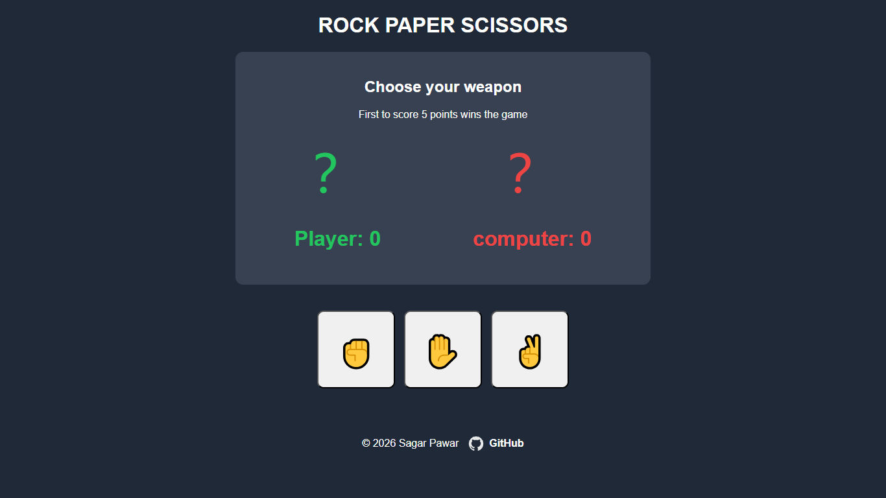
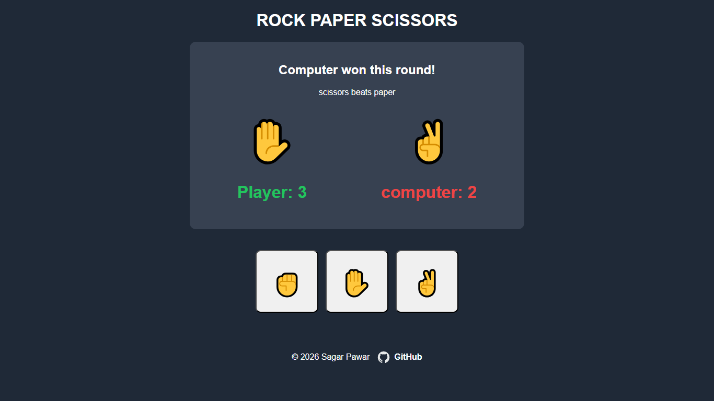
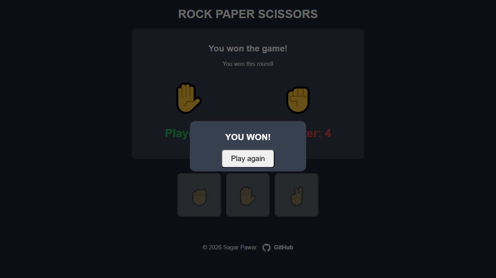

# Rock Paper Scissors

A browser-based Rock Paper Scissors game built with HTML, CSS, and JavaScript.

## Live Demo

[Play Here](https://sagarpawar-dev.github.io/rock-paper-scissors/)

---

## Features

- Interactive user interface
- Random computer choices
- Live score tracking
- Real-time round results
- Player and computer choice display
- First to 5 points wins
- Game Over popup
- Play Again functionality
- Responsive design

---

## Built With

- HTML5
- CSS3
- JavaScript
- DOM Manipulation
- Event Listeners
- Flexbox

---

## Screenshots

### Home Screen

### Gameplay

### Game Over

---

## What I Learned

While building this project, I practiced:

- DOM Manipulation
- Event Handling
- Event Listeners
- Conditional Logic
- JavaScript Functions
- CSS Flexbox
- Responsive Design
- Git and GitHub Workflow

---

## Future Improvements

- Sound effects
- Animations
- Match history
- Improved